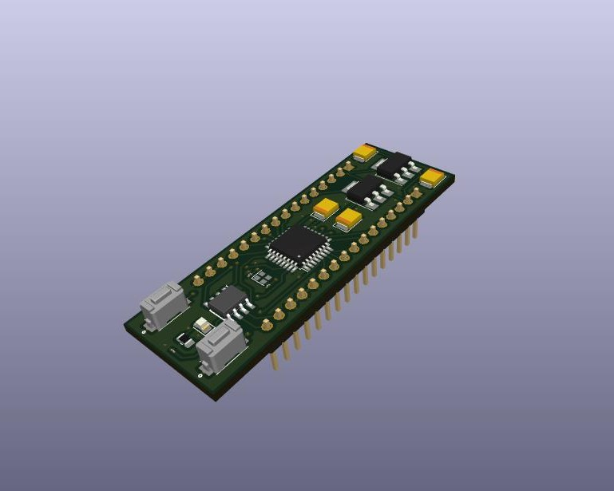

# FDSafe

> A CAN FD project using AES-GCM authenticated encryption for STM32G4.

The goal of this implementation is to validate the applicability of cybersecurity strategies on CAN FD and run tests simulating attack scenarios.

## Projects

This repository is basically a STM32CubeIDE workspace containing the three projects described below.

### FDSafe_Alice

Node that writes messages to the bus. All the data content is simulated, varying based on a senoidal wave with a jitter, and in a realistic range, according to the variable.

Messages generated by Alice are:

| ID        | Variable                          | Unit  |
|-----------|-----------------------------------|-------|
| 0x006F    | Engine speed                      | RPM   |
| 0x014D    | Vehicle speed                     | km/h  |
| 0x0309    | Engine coolant temperature        | °C    |
| 0x03E7    | Fuel level                        | %     |
| 0x07B5    | High Resolution Vehicle Distance  | m     |

The data field structure of the messages is vaguely based on the [FMS Standard](https://www.fms-standard.com/Truck/down_load/fms%20document_v_04_vers.13.10.2017.pdf), using similar positions, units and scales, but custom IDs.

Alice has the criptographic key.

### FDSafe_Bob

Node that reads messages from the bus, parses it according to the same standard used by Alice, and presents the formatted data through UART.

Bob also has the criptographic key.

### FDSafe_Chuck

Node that is able to write to and read from the bus. It is used for performing the attacks:

* Eavesdropping: spy and collect data
* Spoofing: identity theft, sending messages pretending to be Alice

Chuck does not have the criptographic key.

## Hardware

The hardware for the three nodes is a [custom board](doc/fdsafe_schematic.pdf), projected to be used in a breadboard, based on the STM32G431 microcontroller, along with a TCAN1044VDRQ1 CAN FD transceiver.



The nodes should be connected in a bus, using a 120R resistor between CAN-H and CAN-L on each end.


## Authenticated Encryption

The projects use AES-GCM authenticated encryption (AE) to secure the communication against the threats. The implementation used is the one from the [STM32 cryptographic library](https://www.st.com/en/embedded-software/x-cube-cryptolib.html).

> TODO: Detail the data field messages with and without AE

## Attack scenarios

It is possible to compile the programs to perform under four different scenarios and run the tests. The settings detailed for each of them will be in the `Core/Src/app.c` file of each project.

### 1: Eavesdropping attack without AE

Alice and Bob will exchange messages normally without any encription or authentication. In this scenario, it is expected that Chuck will be able to read and get intelligible data from the messages.

Settings to be used:

**Alice**
```C
#define ENCRYPTION_ENABLED 0
#define SIMULATIONS 1
```

**Bob**
```C
#define BOB_DEBUG 0
#define ENCRYPTION_ENABLED 0
#define INTERNAL_LOG 0
```

**Chuck**
```C
#define CHUCK_DEBUG 1
#define MALICIOUS_MODE 0
```

`BOB_DEBUG` and `CHUCK_DEBUG` options define if the data forwarded to UART will be formatted (`0`) or raw (`1`).

### 2: Eavesdropping attack with AE

Alice and Bob will exchange encrypted and authenticated messages. In this scenario, it is expected that Chuck won't be able to read and get intelligible data from the messages.

Settings to be used:

**Alice**
```C
#define ENCRYPTION_ENABLED 1
#define SIMULATIONS 1
```

**Bob**
```C
#define BOB_DEBUG 0
#define ENCRYPTION_ENABLED 1
#define INTERNAL_LOG 0
```

**Chuck**
```C
#define CHUCK_DEBUG 1
#define MALICIOUS_MODE 0
```

### 3: Spoofing attack without AE

While Alice and Bob exchange messages normally without any encription or authentication, Chuck will purposefully inject an empty `0x006F` message into the bus, as if it was sent by Alice. It is expected that Bob will consider this malicious message as valid, since there is no way he can validate it.

Settings to be used:

**Alice**
```C
#define ENCRYPTION_ENABLED 0
#define SIMULATIONS 1
```

**Bob**
```C
#define BOB_DEBUG 0
#define ENCRYPTION_ENABLED 0
#define INTERNAL_LOG 0
```

**Chuck**
```C
#define CHUCK_DEBUG 0
#define MALICIOUS_MODE 1
```

`MALICIOUS_MODE` enables Chuck to inject a "fake" message to the bus.

### 4: Spoofng attack with AE

While Alice and Bob will exchange encrypted and authenticated messages, Chuck will purposefully inject an empty `0x006F` message into the bus, as if it was sent by Alice. It is expected that Bob will be able to identify the unauthenticated messages from Chuck and discard them.

**Alice**
```C
#define ENCRYPTION_ENABLED 1
#define SIMULATIONS 1
```

**Bob**
```C
#define BOB_DEBUG 0
#define ENCRYPTION_ENABLED 1
#define INTERNAL_LOG 0
```

**Chuck**
```C
#define CHUCK_DEBUG 0
#define MALICIOUS_MODE 1
```